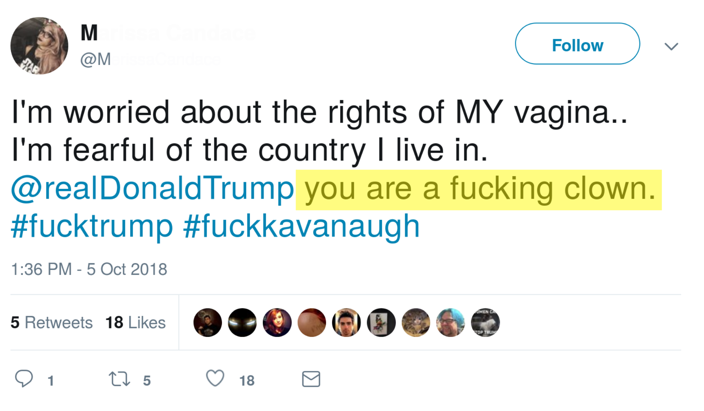
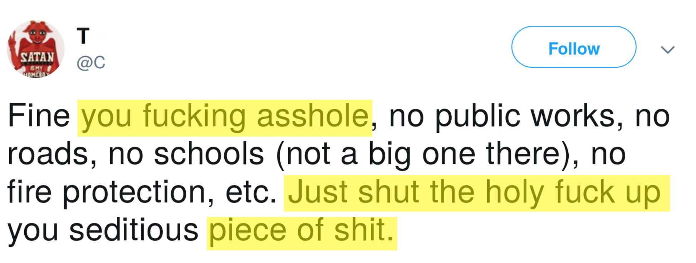
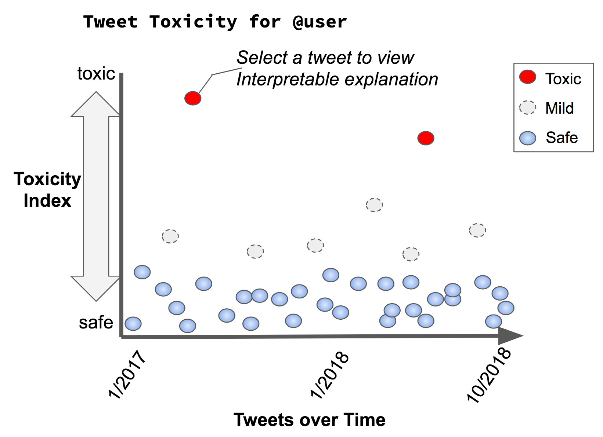

```{r, echo=FALSE}
library(knitr)    # For knitting document and include_graphics function
library(ggplot2)  # For plotting
library(png)      # For grabbing the dimensions of png files
```

#### Adam Wespiser, Ajay Bhargav Baaskaran, Mukund Muralikrishnan, Nachiappan Chockalingam

##What are we trying to do?
A “toxic comment” is any online comment perceived as hurtful, anti-social or disruptive, arising from unresolved conflicting beliefs between people. Our goal is to build a tool that will analyze, understand, and visualize the toxicity in social media comments.

##How is this currently done and what are the limitations?
One application, Sentiment Viz, (Healey and Ramaswamy 2017) ingest tweets, analyzing for sentiment, and present a series of interactive visualization. Plexus is a similar: visualizations of twitter sentiment to help users understand topics of interest. (Wu et al. 2017). These papers are useful demonstrations for what can be done with twitter text analysis, and we will expand these concepts by exploring toxicity with interactive visualizations.    

Toxic comment classification has numerous solutions; however, these algorithms are vulnerable to simple word manipulation to get past toxicity filters. (Rodriguez 2018) Perspective API, a toxic comment classifier as a service, also has difficulty detecting distorted toxic comments, which can be overcome with pre-processing (Hossieni et al. 2018) If such distortion is present in social media text, we plan on implementing the same text pre-processing pipeline as described.    
The state-of-the-art toxicity classifier is an ensemble of 12 different classifiers: both difficult to implement and computationally expensive for our project. (van Aken et al. 2018) . Non-sequential methods, like TF-IDF, proved accurate in the related, but not identical, problem of classifying online hate speech. (Gaydhani et al. 2018) However, logistic regression classifiers tend to misclassify based on word presence, not context, when assigned a similar task. (Davidson et al. 2017) These models, are straightforward to implement, and can be learned using the Kaggle Toxic Comment Classification Challenge Dataset. For our project, they will be a good starting point.    
For better performance, recurrent neural networks, outperform word n-gram models in comment classification tasks (Pavlopoulos et al. 2018). We will build a similar model with Pytorch, (Paszke et al. 2017) a deep learning library with automatic differentiation tools for optimization and easy GPU operations.     
One promising neural architecture is a LSTM-Attention based model, treating inputs as “word vectors” with discernable inter-relationships, and utilizing an attention mechanism to focus on the parts of text most contributing to classification. (Wang et al. 2016) This is especially applicable to our project, where some words are inherently more toxic.    
To provide users feedback on what parts of their comments are causing them to become toxic, recurrent neural networks can be augmented with a “Z-layer”, or interpretable selection of words causing the comment to become toxic. (Svec et al. 2018) Unfortunately, this model is complex and especially difficult to train. A simpler method is called Erasure, which finds the minimal set of words needed to flip a prediction from toxic to non-toxic and would be susceptible to heuristic calculation. (Li et al. 2017). Using dynamic programming, we may be able to improve on this approach. Finally, we can try to use LIME, which gives interpretable explanations for classifiers on which words are causing the prediction of a class label using a model-agnostic algorithm. (Ribeiro 2016). LIME would be extremely useful, since it will be able to highlight problematic words and allow us the freedom to explore a breadth of underlying models. (Figure 1 and 2)    

##What's new in your approach and why do you think it will be successful?
The novelty our our approach is the unique combination of machine learning and data visualization techniques. Our approach will be successful because toxic comment classifier are well-characterized and visualizing their results will provide a useful service to social media users.

##Who cares?
Anyone interested in ensuring their online community is safe and inclusive, people curious about their own comments, as well as organizations who perceive toxicity as a problem.

##What difference will this make?
Given the widespread nature of anti-social behavior, and high probability a given individual will at one time participate, (Cheng et al. 2017), we believe our application will help users reflect on how their own comments have affected others. This effort will increase awareness for the widespread presence of toxic comments and encourage users to ultimately change their own behavior.    

##What are the risks?
We rely on labelled datasets to classify toxic comments. It’s possible we will not have enough data, or that the labelled data either doesn’t fully capture toxicity.
If social media users obfuscate toxic comments, we will have to augment our data sources or use a pre-filtering step. 

##How much will this cost?
100 GPU hours at [$0.50 per hour](https://cloud.google.com/gpu/) = $50.    
We need 2 servers, one for hosting the website, and one for running the API, for about 3 months. This will cost $144.   
Miscellaneous costs hard drives [($0.04/GB . Month)](https://cloud.google.com/persistent-disk/), and network IO [ ($0.10/GB)](https://cloud.google.com/network-tiers/pricing), which total $10 + $10 = $20.   
The total will be $214.   

##Plan of activities and how long it will take


###Data Ingestion:
Time estimate: 3 - 4 weeks

* Use Twitter API or web scraping to collect data
* Use Google Compute Services to store data

###Backend + ML+ Infrastructure:
Time estimate: 2 - 3 weeks

* Use [Perspective API](https://www.perspectiveapi.com/#/) to classify a comment as is toxic. 
* Finding an algorithm with good performance for toxic comment classification, like Recurrent Neural Networks, and replace Perspective API.
* Use Google Compute Services to host the web server and front-end

###Design + Front-end:
Time estimate: 4 - 5 weeks

* Brainstorm a set of visualization and interactions ideas using the entire team. (see Figure 3) 
* Shortlist a set of these ideas.
* Build mockups for the shortlisted ideas, and use feedback from users and personas to refine ideas.
* Start implementing them incrementally and integrating the toxic comment classification API.

##What are the mid-term and final “exam” deliverables?
First, we build our prototype: using web scraped data processed through a basic toxic comment classifier, presenting a simple visualization for the mid-term.
Final exam: finalized web application, with a full set of interactive display features, and interacting with our toxic comment analyzer API and client for comment data collection. 

##Team member effort
All team members have contributed similar amount of effort


\pagebreak
  
  

```{r pressure, echo=FALSE, fig.cap="An example toxic tweet with highlights",fig.align="center", out.width = '70%'}
library(knitr)

```


\pagebreak
. 
  

```{r, echo=FALSE, fig.cap="An example toxic tweet with highlights",fig.align="center", out.width = '70%'}



```


\pagebreak


```{r, echo=FALSE, fig.cap="A visualization of toxicity in a users tweets through time",fig.align="center", out.width = "70%"}

```


\newpage

##Citations

1. Betty van Aken, Julian Risch, Ralf Krestel and Alexander Loser, 2018, Challenges for Toxic Comment Classification: An In-Depth Error Analysis, https://arxiv.org/abs/1809.07572

2. Justin Cheng, Michael Bernstein, Christain Danescu-Niculescu-Mizil, and Jure Leskovec. 2017. Anyone Can Become a Troll: Causes of Trolling Behavior in Online Discussions.CSCW Conf Comput Support Coop Work. 2017 Feb-Mar; 2017: pages 1217–1230. https://www.ncbi.nlm.nih.gov/pmc/articles/PMC5791909/pdf/nihms933916.pdf

3. Thomas Davidson, Dana Warmsley, Michael Macy, Ingmar Weber, 2017, Automated Hate Speech Detection and the Problem of Offensive Language. https://arxiv.org/pdf/1703.04009.pdf

4. Aditya Gaydhani, Vikrant Doma, Shrikant Kendre and Laxmi Bhagwat. 2018. Detecting Hate Speech and Offensive Language on Twitter using Machine Learning: An N-gram and
TFIDF based Approach. https://arxiv.org/pdf/1809.08651.pdf

5. Healey and Ramaswamy. 2017. Visualizing Twitter Sentiment. https://www.csc2.ncsu.edu/faculty/healey/tweet_viz/

6. Hossein Hossieni, Sreeram Kannan, Baosen Zhang and Radha Poovendran. 2017. Deceiving Google’s Perspecitve API Built for Detecting Toxic Comments. https://arxiv.org/pdf/1702.08138.pdf

7. Jiwei Li, Will Monroe, and Dan Jurafsky. 2016. Understanding neural networks through representation erasure. https://arxiv.org/pdf/1612.08220.pdf

8. John Pavlopoulos, Prodromos Malakosiotis, Ion Audroutsopoulos. 2017. Deeper Attention to Abusive User Content Moderation. Proceedings of the 2017 Conference on Empirical Methods in Natural Language Processing, pages 1125–1135. http://www.aclweb.org/anthology/D17-1117

9. Adam Paszke et al. 2017. Automatic Differentiation in PyTorch. 31st Conference on Neural Information Processing Systems (NIPS 2017). https://openreview.net/pdf?id=BJJsrmfCZ

10. Marco Tulio Ribeiro, Sameer Singh, Carlos Guestrin. 2016. "Why should I Trust You?" Explaining the Predictions of Any Classifier. https://arxiv.org/pdf/1602.04938.pdf

11. Nester Rodriguez, Sergio Rojas-Galeano. 2018. Shielding Google’s language toxicity model against adversarial attacks. https://arxiv.org/pdf/1801.01828.pdf

12. Anrej Svec, Matus Pikuliak, Marian Simko, Maria Bielikova. 2018. Improving Moderation of Online Discussions via Interpretable Neural Models. https://arxiv.org/pdf/1809.06906.pdf

13. Yequan Wang, Minlie Huang, Li Zhao, and Xiaoyan Zhu. 2016. Attention-based LSTM for Aspect-level Sentiment Classification. Proceedings of the 2016 Conference on Empirical Methods in Natural Language Processing, pages 606–615. https://aclweb.org/anthology/D16-1058

14. Xiaodong Wu, Lyn Bartram, Chris Shaw. 2017. Plexus: An Interactive Visualization Tool for Analyzing Public Emotions from Twitter Data. https://arxiv.org/pdf/1701.06270.pdf
